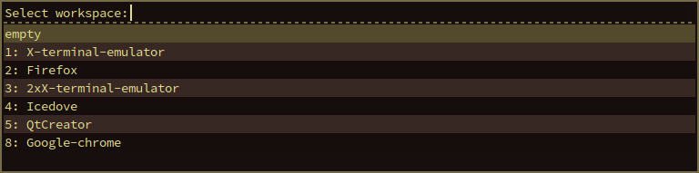
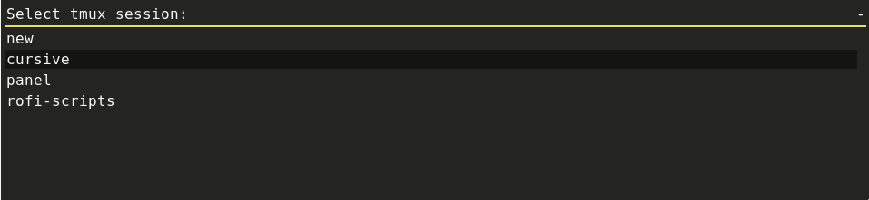

# Rofi based scripts


## i3_switch_workspace.sh

### Usage

```bash
./i3_switch_workspace.sh
```
### Screenshot



## monitor_layout.sh

### Usage

```bash
./monitor_layout.sh
```
### Screenshot


## rofi_gtk_colors.py

Tries to generate colors from current Gtk+-3.0 theme.
Based on code in Mate-HUD.

## tmux_session.sh

Attach to a running `tmux` session or create a new one.
Since this script starts a new terminal it can also been used with a keybinding from your favorite window-manager.

### Usage

Interactive usage
```bash
./tmux_session.sh
```

Example of i3 keybinding
```bash
bindsym $mod+Shift+t exec ~/rofi-scripts/tmux_session.sh
```


