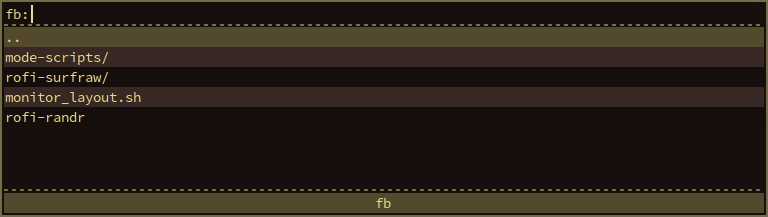
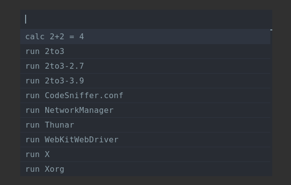

# Mode scripts

Mode scripts are running by calling them as a mode:

rofi -modi "name:script.sh" -show name


## File Browser

### Usage

```bash
rofi -modi "fb:./rofi-file-browser.sh" -show fb
```
### Screenshot



## Calc

### Usage

Make sure bc, python or bcalc is installed. Check `rofi-calc.sh` comments for details.

To show calculator mode:

```bash
rofi -modi "calc:./rofi-calc.sh" -show calc
```

or, to show in combination with run mode:

```bash
rofi -combi-modi "calc:./rofi-calc.sh",run -show combi
```

### Screenshot


