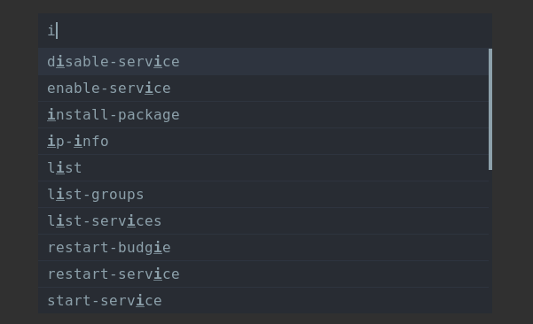

# Mode scripts

Mode scripts are running by calling them as a mode:

rofi -modi "name:script.sh" -show name


## File Browser

### Usage

```bash
rofi -modi "fb:./rofi-file-browser.sh" -show fb
```
### Screenshot


## Aliases

### Usage

Remember to have a valid `$TERMINAL` set on system or change the `TERMINAL=` line on `rofi-aliases.sh`.

To get a list of aliases:

```bash
rofi -modi "aliases:./rofi-aliases.sh" -show aliases
```

or, to use in combination with run:

```bash
rofi -combi-modi run,"aliases:./rofi-aliases.sh" -show combi
```

### Screenshot


