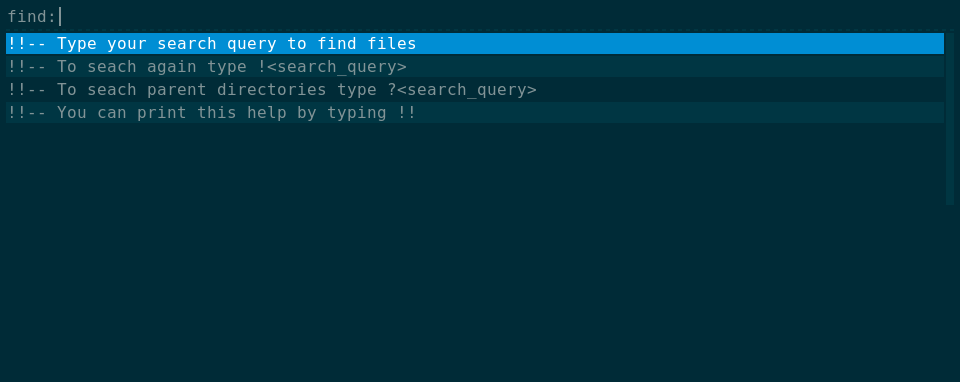
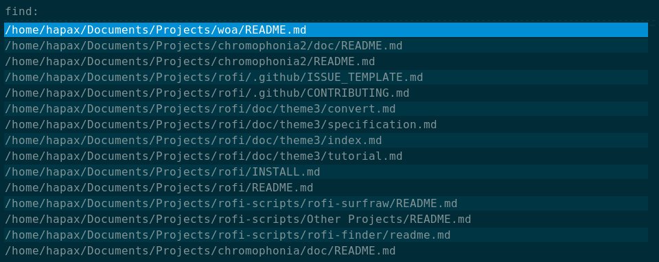
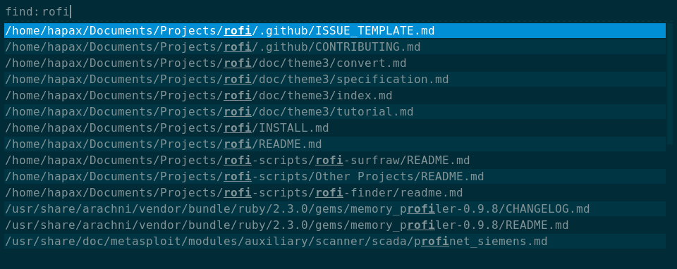
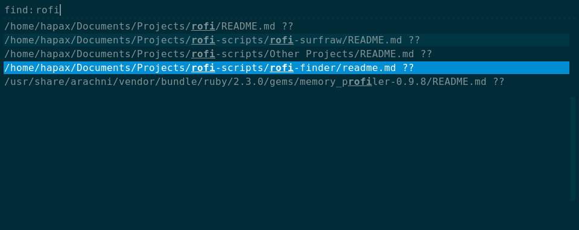
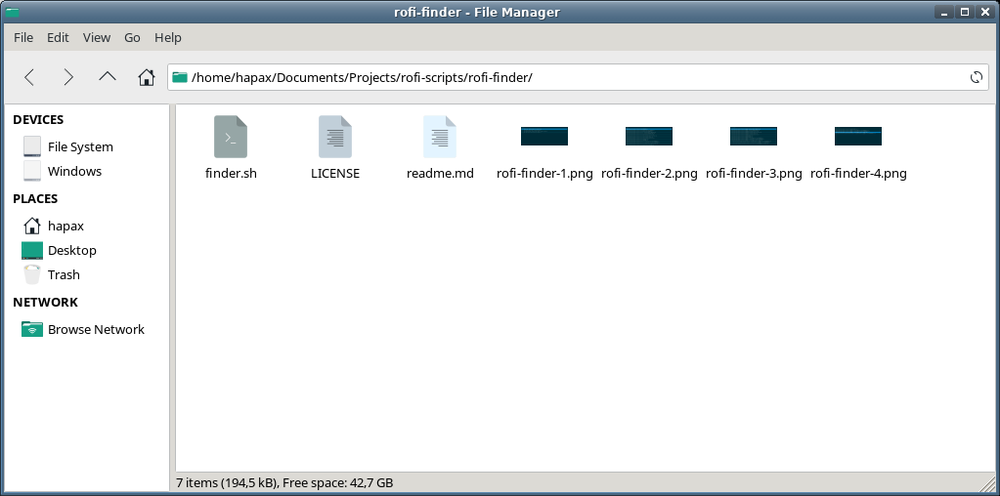

# Rofi finder

### Usage
If you put ```finder.sh``` under ```~/.local/share/rofi/finder.sh``` then:

```bash
rofi  -show find -modi find:~/.local/share/rofi/finder.sh
```
### Features
Type your search query to find files.

To seach again type ```!<search_query>```

To seach parent directories type ```?<search_query>```

You can print this help by typing ```!!```

### Screenshots

Type your search query to find files and press enter:



The search result will be displayed in the screen:



You can filter the results by typing in the search box:



If you want to find a folder containing a file you can type ```?<search_query>```



If you see ```??``` at the end of the result line you can press enter to open the file containing that file.


